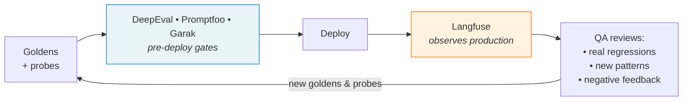

~~# AI Testing Stack — Feature Analysis

Comparison of four open-source frameworks — **DeepEval**, **Promptfoo**, **Langfuse**, **Garak** — for evaluating LLM-backed endpoints in `spring-ai-lab` (`/ai/generate`, `/support`, `/agent/chat`). Audience: dev team picking a testing and observability stack for an AI bot.

> **TL;DR.** The four tools are **complementary, not competitors**. They cover different layers of the testing/observability story (offline eval, production observability, security probing). The recommendation is a stack of 2–3 of them, not a single winner. DeepEval and Promptfoo overlap heavily — pick one. Langfuse and Garak are non-overlapping additions. Runtime guardrails (blocking harmful outputs at inference time) are deliberately out of scope — they are application architecture, not QA tooling.

---

## 1. Industry-standard stack for AI bot teams

Production teams shipping LLM features typically structure their testing/observability into **layers**, not tools. Each layer answers a different question:

| Layer | Question it answers | Tools that fit |
|---|---|---|
| **Offline eval** (CI gate) | Does this PR degrade quality? | DeepEval, Promptfoo, Ragas |
| **Production observability** | What is actually happening in prod? | Langfuse, LangSmith, Phoenix |
| **Security / red-team** | Can the bot be jailbroken or made to leak? | Garak, DeepTeam, Patronus |
| **Runtime guardrails** | Block harmful outputs in real time | LlamaGuard, NeMo Guardrails, OpenAI Moderation |

The four tools in this POC cover the first three layers. **Runtime guardrails are out of scope by design** — they are application architecture decisions (LlamaGuard, NeMo Guardrails, OpenAI Moderation, etc.), not QA tooling. The dev team chooses, deploys, and maintains them; QA verifies they work end-to-end via the four tools below.

### Pipeline placement

```
┌─────────────┐  ┌─────────────┐  ┌─────────────┐  ┌─────────────┐
│ Local dev   │  │ PR / CI     │  │ Pre-release │  │ Production  │
└─────────────┘  └─────────────┘  └─────────────┘  └─────────────┘
      │                │                │                │
   Promptfoo         DeepEval          Garak           Langfuse
 (prompt iter)    (regression       (security        (live obs +
                   gate)             scan)            online eval)
```

### QA feedback loop

The pipeline above shows the linear path from dev to production. In practice, QA is not a one-time gate — it is a loop. Production data captured by Langfuse feeds back into the pre-deploy test suites, enriching goldens and probes with real-world cases that QA could not have anticipated.



This is why Langfuse is QA tooling, not post-QA. Without it, QA only validates against cases the team imagined. With it, QA validates against actual user behavior, and the test suites grow organically with the product.

### MVP setup

A team starting out:

- **One offline eval tool** (DeepEval or Promptfoo) wired into CI
- Basic application logging in production — no dedicated observability platform yet
- A **runtime guardrail** (LlamaGuard or OpenAI Moderation API) before responses go to users
- Manual security review before launch — no automated scan yet

This is the minimum to ship without flying blind. License cost: $0. Operational cost: judge-model API calls.

### Production setup

As usage grows and the team matures:

- **Offline eval** as a hard CI gate (DeepEval or Promptfoo)
- **Production observability** with full tracing, cost tracking, and online evals (Langfuse)
- **Security scans** in the release process (Garak nightly or pre-release)
- **Runtime guardrails** maintained and tuned
- Optional: synthetic dataset generation, prompt versioning, A/B testing of prompts

This is the full stack the POC is evaluating.

---

## 2. Free vs paid per tool

| Tool | Free (OSS) covers | Paid features add |
|---|---|---|
| **DeepEval** | All 20+ metrics, DeepTeam (red-team), Synthesizer, pytest integration, pluggable judge model, local results | **Confident AI Cloud** (optional): hosted dashboard, shared datasets, run history, production observability |
| **Promptfoo** | All assertions, all providers, local web viewer (`promptfoo view`), red-team plugin, CI integration, public sharing via `--share` | **Promptfoo Enterprise**: private team sharing, SSO, RBAC, hosted dashboard, commercial support |
| **Langfuse** | Full tracing / sessions, datasets, evaluators, prompt management, playground — fully self-hostable | **Langfuse Enterprise** (even when self-hosted): RBAC, SSO, audit logs, data masking. **Langfuse Cloud**: managed tiers (free Hobby + paid Core / Pro / Enterprise) |
| **Garak** | Everything — 100+ probes, all detectors, HTML/JSON reports, REST generator, resumable runs | None — fully OSS, no paid tier |

The OSS versions are sufficient for a POC and most production setups. The paywall typically kicks in around team collaboration, compliance features (SSO / RBAC / audit), or hosted infrastructure — not core eval functionality. Exact pricing changes; verify on each vendor's pricing page before quoting numbers.

---

## 3. Per-tool brief overview

### DeepEval
Pytest-style offline eval library for Python teams. Strongest on RAG-specific metrics (`Faithfulness`, `ContextualPrecision/Recall`) and conversational metrics (`KnowledgeRetention`, `ConversationRelevancy`). Pluggable judge model (OpenAI, Anthropic, or local Ollama). Best fit when the team writes tests as `pytest` cases and wants tight CI integration. License: Apache-2.0.

### Promptfoo
YAML-driven eval CLI optimized for **prompt + provider matrix comparison** (`N prompts × M models × K cases` in one config). Generates shareable HTML/JSON reports. First-class HTTP provider support — works against any backend, not just LLM SDKs. Best fit when prompt engineering is iterative or the team prefers config over code. License: MIT.

### Langfuse
Production observability + eval platform. OpenTelemetry-compatible tracing, sessions, cost tracking, evaluators that run over production traces (online or offline). Includes prompt management with versioning and a playground. Self-hostable (Postgres + Clickhouse + Redis) or managed Cloud. Best fit for understanding what real users send and how the model responds at scale. License: MIT (core); Enterprise features under commercial terms.

### Garak
LLM vulnerability scanner — "nmap for LLMs" — from NVIDIA. 100+ curated probes: jailbreaks (DAN), prompt injection, encoding obfuscation, training-data leakage, toxicity. REST generator points at any HTTP endpoint. Best fit for pre-release security audits and periodic safety regression. Not a coherence or correctness tool. License: Apache-2.0.

---

## 4. Overlap matrix

| Capability | DeepEval | Promptfoo | Langfuse | Garak |
|---|:-:|:-:|:-:|:-:|
| LLM-as-judge metrics | ✅ | ✅ | ✅ | ⚠️ limited |
| Multi-turn / conversational eval | ✅ | ⚠️ | ✅ | ❌ |
| RAG-specific metrics | ✅ | ✅ | ✅ | ❌ |
| Cross-prompt / cross-model A/B | ⚠️ | ✅ | ⚠️ | ❌ |
| Production trace ingestion | ❌ | ❌ | ✅ | ❌ |
| Cost / latency / token tracking | ❌ | ⚠️ asserts only | ✅ | ❌ |
| Prompt versioning + playground | ❌ | ⚠️ git-native | ✅ | ❌ |
| Curated jailbreak / injection probes | ⚠️ DeepTeam | ⚠️ red-team plugin | ❌ | ✅ |
| Toxicity / bias scoring | ✅ | ✅ | ✅ | ✅ |
| Pytest-native | ✅ | ⚠️ wrapper | ❌ | ❌ |
| CLI-native | ⚠️ | ✅ | ❌ | ✅ |

### The two real overlaps

**DeepEval ↔ Promptfoo** — both score offline test cases with LLM-as-judge. **Pick one**, not both.
- DeepEval if the team is Python-first and pytest-driven.
- Promptfoo if the team prefers YAML config or matrix prompt/model comparison is a recurring need.

**DeepEval (DeepTeam) ↔ Garak** — both do red-teaming, but differently.
- DeepTeam fuzzes your specific app with an attacker LLM (good for application-layer risks: role confusion, tool misuse).
- Garak runs a curated, peer-reviewed probe corpus (good for model-layer risks: jailbreaks, encoding bypass, leakage).
- They complement rather than replace each other.

### Where they complement (no overlap)

- **Langfuse** is the only one ingesting production traffic. Without it, there is no visibility into real user behavior.
- **Garak** is the only one with a curated safety probe library. Without it, you'd construct attacks manually.
- **Promptfoo** is the only one optimized for one-shot prompt/model A/B matrices.

---

## 5. Recommendation

For a team adopting a testing stack from these four tools:

1. **Offline eval (CI gate)** — Pick **one** of DeepEval or Promptfoo.
   - DeepEval if Python-first and `pytest`-driven.
   - Promptfoo if the team prefers YAML config or needs prompt/model matrix comparison.
   - Running both long-term yields no additional coverage.

2. **Production observability** — Adopt **Langfuse self-hosted**. The OSS version is sufficient for most needs. Consider Enterprise features (RBAC/SSO) only when team size or compliance demands it.

3. **Security** — Run **Garak** periodically (nightly or pre-release). It's free and provides a baseline against known attack patterns that is hard to replicate manually.

4. **Runtime guardrails** *(out of scope)* — Application architecture, not QA tooling. The dev team owns the choice and deployment (e.g., LlamaGuard, NeMo Guardrails, OpenAI Moderation); the four QA tools above verify they work end-to-end.

License cost: $0. Real costs are judge-model API calls (or local Ollama if fully offline) and Langfuse infrastructure if self-hosted.

---

## Appendix — Technical reference

> Implementation-relevant details that don't fit in the main comparison. Useful when actually wiring up each tool.

| Tool | Judge model | Test/config shape | CI integration |
|---|---|---|---|
| **DeepEval** | Pluggable — OpenAI/Anthropic, or any `DeepEvalBaseLLM` impl (e.g. local Ollama) | `LLMTestCase(input, actual_output, expected_output, ...)` → `assert_test(case, [metrics])` | `pytest` invocation; exit code drives gate |
| **Promptfoo** | OpenAI default, configurable per-assertion | `tests:` array in `promptfooconfig.yaml` with `vars` + `assert` | `npx promptfoo eval --output report.html`; exit code drives gate |
| **Langfuse** | Configurable per evaluator | Two flavors: (a) attach evaluator to prod traces; (b) run dataset against app via SDK | Continuous (not PR-gating); typically nightly evals on production traces |
| **Garak** | Classifier-based detectors; a few use OpenAI for grading | `garak --model_type rest --model_name <config.json> --probes <list>` | Nightly (long-running); exit code can fail a job on hit-rate threshold |

> **Note on local judges:** Ollama models below 7B parameters produce noisy and inconsistent scores. For reliable evals, use a 7B+ model locally or a hosted judge (OpenAI/Anthropic).~~
