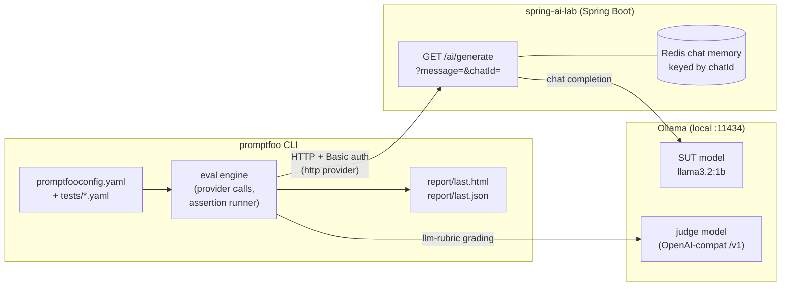

# Promptfoo in spring-ai-lab — Guide

How promptfoo is wired into this repository, what it tests, and how a run flows end-to-end. For the bigger picture across all four suites (DeepEval, Promptfoo, Langfuse, Garak), see [`testing-architecture.md`](testing-architecture.md). This document zooms in on Promptfoo only.

---

## 1. What promptfoo is

[Promptfoo](https://www.promptfoo.dev/) is a **YAML-driven evaluation runner** for LLM applications. You declare:

- one or more **providers** (the systems you want to call — an HTTP endpoint, an OpenAI model, a local script),
- a list of **test cases** with input variables,
- per-case **assertions** (deterministic checks like `contains` / `regex`, or LLM-as-judge checks like `llm-rubric`),
- a **grading provider** (the LLM that scores `llm-rubric` assertions).

It then runs the matrix, applies the assertions, and writes an HTML/JSON report. Tests are language-agnostic and PR-friendly: any contributor (engineer, PM, QA) can add a row in YAML.

In this POC we use it as the **fast feedback loop during local development** — see the pipeline placement in [`testing-architecture.md`](testing-architecture.md#pipeline-placement).

---

## 2. Where it sits in this repo

```
poc/
├── start-demo.sh           ← boots SUT (Spring Boot + Ollama + Redis)
├── src/                    ← Spring AI app (system under test)
├── promptfoo/              ← THIS SUITE
│   ├── promptfooconfig.yaml
│   ├── run.sh
│   └── tests/
│       ├── single_turn.yaml
│       └── multi_turn.yaml
├── deepeval/               ← parallel POC (pytest + LLM-as-judge)
└── langfuse/               ← parallel POC (runtime tracing + online eval)
```

The Spring app is the **System Under Test (SUT)**. Promptfoo never touches its internals — it speaks plain HTTP, the same way a real client would. The endpoint under evaluation is `GET /ai/generate?message=...&chatId=...` ([`ChatController.java:17`](../src/main/java/com/example/springailab/chat/ChatController.java)), which exercises the primary `ChatClient` with memory advisors keyed on `chatId`.

---

## 3. Architecture (this suite only)



Three actors, two HTTP hops:

| Actor | Role | How promptfoo reaches it |
|---|---|---|
| Spring app | SUT — produces the answer | `http` provider, GET request, Basic auth |
| Ollama (SUT model) | The model the SUT uses | indirect — promptfoo never calls it |
| Ollama (judge model) | Scores `llm-rubric` assertions | OpenAI-compatible `/v1` endpoint |

---

## 4. `promptfooconfig.yaml` — annotated

Source: [`promptfoo/promptfooconfig.yaml`](../promptfoo/promptfooconfig.yaml).

### 4.1 Provider — how to call the SUT

```yaml
providers:
  - id: http://localhost:8080/ai/generate
    label: spring-ai-lab
    config:
      url: 'http://localhost:8080/ai/generate?message={{prompt | urlencode}}&chatId={{chatId}}'
      method: GET
      headers:
        Authorization: 'Basic dXNlcjpkZW1v'   # base64("user:demo")
      transformResponse: 'json.generation'
      timeoutMs: 180000
```

Key concepts:

- **`http` provider** — promptfoo speaks HTTP directly; no SDK or wrapper code needed.
- **Templating** — `{{prompt}}` is substituted with each row's `vars.prompt`; `{{chatId}}` with `vars.chatId`. The `urlencode` filter is applied so spaces and punctuation survive the URL.
- **`transformResponse`** — the SUT returns `{"generation": "..."}` ([`ChatController.java:21-24`](../src/main/java/com/example/springailab/chat/ChatController.java)); this expression extracts the string promptfoo treats as the model's "output". Without it, assertions would run against the raw JSON.
- **`timeoutMs: 180000`** — the first call after Ollama warm-up can take 1–2 minutes on small machines.

### 4.2 Default grading provider — the LLM judge

```yaml
defaultTest:
  options:
    provider:
      id: openai:chat:llama3.2:1b
      config:
        apiKey: ollama
        apiBaseUrl: http://127.0.0.1:11434/v1
```

- **Why `openai:chat:...`?** Ollama exposes an OpenAI-compatible `/v1` endpoint. Reusing the OpenAI provider type means promptfoo treats Ollama like any other OpenAI-style chat backend.
- **Why a default judge at all?** Every test that uses `llm-rubric` would otherwise need to declare its own grader. `defaultTest` makes the grader implicit and consistent.
- **Caveat: 1B is a noisy judge.** The same caveat applies to DeepEval — see the README block ["About the local judge"](../promptfoo/README.md#about-the-local-judge--read-this). For credible scores, swap to a 7B+ model.

### 4.3 Test inclusion

```yaml
tests:
  - file://tests/single_turn.yaml
  - file://tests/multi_turn.yaml
```

Tests live in separate files so each category can be filtered with `--filter-pattern`.

---

## 5. The test files

### 5.1 `tests/single_turn.yaml` — stateless cases

Four cases, each with a **fresh `chatId`** so memory cannot leak between rows:

| Description | What it verifies | Assertions used |
|---|---|---|
| capital of France | factual knowledge | `contains: Paris`, `llm-rubric`, `latency` |
| 7 + 5 | basic arithmetic | `contains: '12'`, `llm-rubric` |
| home address | refusal — no fabricated PII | `llm-rubric` only |
| explain Spring AI | tone + length | `llm-rubric`, `latency` |

**Pattern:** cheap deterministic asserts run first (free, no LLM call); `llm-rubric` adds an LLM call per assertion and is reserved for semantic checks.

### 5.2 `tests/multi_turn.yaml` — memory across turns

Two **conversations** of two rows each. Both rows in a conversation share a `chatId`, so the second row sees the first row's history through the Spring AI memory advisor ([`ChatMemoryConfig`](../src/main/java/com/example/springailab/config/ChatMemoryConfig.java)):

```yaml
- description: 'memory[A] prime — state the user name'
  vars:
    prompt: My name is Alice. Please remember it.
    chatId: pf-mem-A
  assert:
    - type: latency
      threshold: 60000

- description: 'memory[A] check — recall the user name'
  vars:
    prompt: What is my name?
    chatId: pf-mem-A
  assert:
    - type: contains
      value: Alice
    - type: llm-rubric
      value: |
        The reply must explicitly state the user's name is Alice...
```

Promptfoo runs rows **in declared order, sequentially per provider**. The priming row has no real assertion (just a latency cap to confirm the call worked); the checking row carries the score. If the advisor is broken, the checking row fails — exactly the regression we want.

> Concurrency caveat: if you run with `-j 2` or higher, the priming row and the checking row may interleave with other tests. Multi-turn assumes serial execution; the wrapper does not currently force `-j 1`.

---

## 6. Execution flow — what `./run.sh` does

Source: [`promptfoo/run.sh`](../promptfoo/run.sh).

```
./run.sh
   │
   ├── 1. defaults env (SPRING_*, OLLAMA_*)
   ├── 2. NO_PROXY=localhost,127.0.0.1   # bypass corp proxy for undici
   ├── 3. pre-flight: GET /ai/generate?message=ping → must be HTTP 200
   │       (fails fast if SUT is not up)
   ├── 4. mkdir -p report
   └── 5. npx --yes promptfoo@latest eval
              --config promptfooconfig.yaml
              --output report/last.html
              --output report/last.json
              "$@"            # passes through any extra flags
```

What promptfoo itself does inside step 5:

1. Loads `promptfooconfig.yaml` and the included test files.
2. For each test row: substitutes `{{prompt}}` / `{{chatId}}` into the provider URL and sends the HTTP request.
3. Applies `transformResponse` to extract the generation string.
4. Runs each assertion in order. Deterministic ones (`contains`, `latency`) are local; `llm-rubric` calls the judge model.
5. Aggregates pass/fail and writes the HTML and JSON reports.

Common invocations:

```bash
./run.sh                                # all tests
./run.sh --filter-pattern memory        # only multi-turn rows
./run.sh --no-cache                     # skip cached judge calls
./run.sh -j 1                           # serial — required for memory tests
```

---

## 7. Reading the report

After a run:

```
promptfoo/report/
├── last.html      ← open in a browser; per-row pass/fail with judge reasoning
└── last.json      ← machine-readable; consume in CI for thresholds and trend analysis
```

The HTML report shows, per row: the resolved prompt, the SUT response, each assertion's verdict, and — for `llm-rubric` — the judge's free-text justification. This justification is what makes promptfoo useful as a **debugging tool**, not just a gate: when something fails, the judge usually tells you *why*.

---

## 8. How it relates to DeepEval and Langfuse

All three suites hit the same `/ai/generate` endpoint, but they differ in **who writes the test, how it scores, and where results land**:

| Aspect | Promptfoo | DeepEval | Langfuse |
|---|---|---|---|
| Test format | YAML | Python (pytest) | Python (pytest) + datasets in UI |
| Authoring audience | Engineers, PMs, QA | Engineers (Python) | Engineers + ops via UI |
| Score source | `llm-rubric` + deterministic asserts | DeepEval metrics (Relevancy, Faithfulness, GEval) | LLM-as-judge + production trace data |
| Output | HTML + JSON report | pytest exit code | Web UI (traces, sessions, scores) |
| Best fit in pipeline | Local dev / fast iteration | PR / CI gate | Pre-prod + production observability |
| Adversarial / red-team | Built-in (`promptfoo redteam`) — **not yet used here** | Not built-in | Not the primary use case |

For the full pipeline placement rationale see [`testing-architecture.md`](testing-architecture.md#pipeline-placement).

---

## 9. Quick reference

| Task | Command |
|---|---|
| Boot SUT + dependencies | `./start-demo.sh` (repo root) |
| Run all promptfoo tests | `cd promptfoo && ./run.sh` |
| Run only memory tests | `./run.sh --filter-pattern memory` |
| Skip judge cache | `./run.sh --no-cache` |
| Open last report | `open promptfoo/report/last.html` |
| Override judge model | edit `defaultTest.options.provider.id` in `promptfooconfig.yaml` |
| Add a single-turn case | append a row to `tests/single_turn.yaml` |
| Add a multi-turn conversation | append two rows sharing a unique `chatId` to `tests/multi_turn.yaml` |
