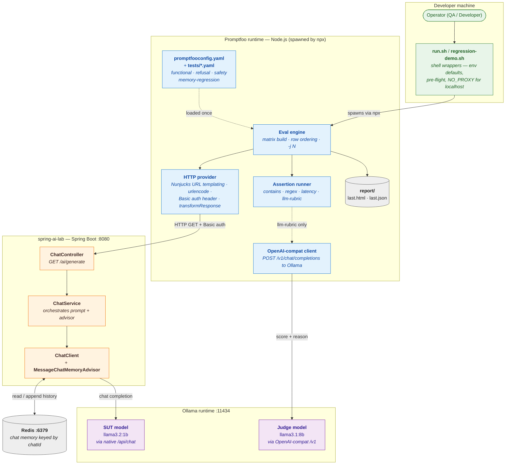
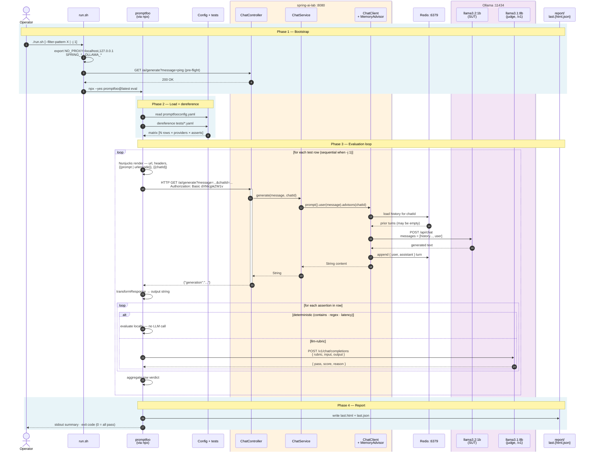
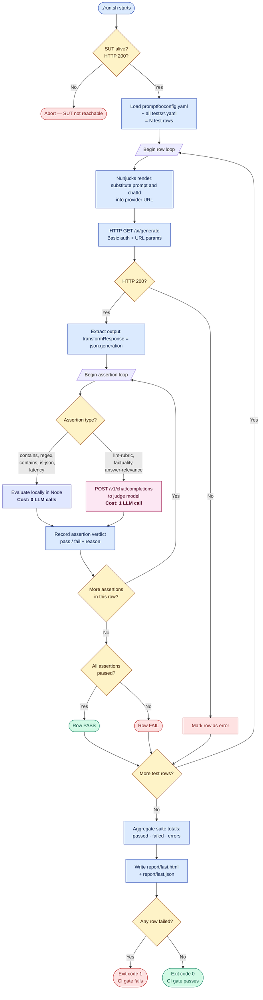

# Promptfoo — Lifecycle and Component Diagram

> Reference artifact for the Promptfoo POC. Three complementary views of the
> end-to-end evaluation pipeline as it is wired in this repository:
>
> 1. **Topology** — every participating process and class, at a glance.
> 2. **Lifecycle** — time-ordered sequence from `./run.sh` to `report/last.html`.
> 3. **Control flow** — branching logic and assertion cost (where the eval
>    decides, and what each branch costs).
>
> All three diagrams reference the exact source files so a reviewer can
> navigate straight from the picture to the code.

---

## 1. Topology — what each box is and where it runs

### Reading the topology

| Group | What runs there | Where the code lives |
|---|---|---|
| **Developer machine** | Shell wrappers that set env defaults, do a pre-flight against the SUT, and spawn Promptfoo. | [`promptfoo/run.sh`](../promptfoo/run.sh) · [`promptfoo/regression-demo.sh`](../promptfoo/regression-demo.sh) |
| **Promptfoo runtime** | The Node.js process spawned by `npx`. Loads the YAML config, builds the test matrix, calls the SUT, runs assertions, writes the report. | [`promptfoo/promptfooconfig.yaml`](../promptfoo/promptfooconfig.yaml) · [`promptfoo/tests/*.yaml`](../promptfoo/tests/) |
| **spring-ai-lab** | The system under test. Stateless HTTP controller backed by a chat client with a memory advisor. | [`ChatController.java`](../src/main/java/com/example/springailab/chat/ChatController.java) · [`ChatService.java`](../src/main/java/com/example/springailab/chat/ChatService.java) · [`ChatClientConfig.java`](../src/main/java/com/example/springailab/config/ChatClientConfig.java) |
| **Redis** | Persists the per-`chatId` conversation history that `MessageChatMemoryAdvisor` injects on each turn. | `docker-compose.yml` |
| **Ollama** | Hosts both models on a single port. The same process serves the SUT (via the native `/api/chat` endpoint) and the judge (via the OpenAI-compatible `/v1` endpoint). | `docker-compose.yml` |

### LLM consumption summary

| Role | Model | Endpoint | Called by |
|---|---|---|---|
| **System under test** | `llama3.2:1b` | `POST /api/chat` (Ollama native) | Spring AI `ChatClient` |
| **Judge** (`llm-rubric` only) | `llama3.1:8b` | `POST /v1/chat/completions` (OpenAI-compatible) | Promptfoo assertion runner |

Both models live in the same Ollama process. The asymmetry — *judge stronger than SUT* — is intentional and documented in [`poc.md` §1](../promptfoo/poc.md#1-goal).

---

## 2. Lifecycle — end-to-end sequence

### Reading the lifecycle

**Phase 1 — Bootstrap.** The shell wrapper exists for one reason: setting the
environment that Promptfoo needs to work in a corporate environment. `NO_PROXY`
is the critical bit — without it, `undici` (Node's HTTP client) routes every
request through `HTTPS_PROXY` and times out trying to reach `localhost` via
the corporate proxy. The pre-flight curl gives a fast, readable failure when
the SUT is not up.

**Phase 2 — Load + dereference.** Each `file://tests/<name>.yaml` import is
expanded into actual row objects in memory. The matrix that comes out is
`providers × rows × asserts`. Only one provider is configured today; multi-
provider comparison is a future demo ([`poc.md` Demo 4](../promptfoo/poc.md#demo-4--multi-provider-comparison-advantage)).

**Phase 3 — The eval loop.** This is the work. Each row is one fully
independent invocation of the SUT plus its assertions, except for memory-
regression rows that share a `chatId` and therefore *depend on row ordering*
— which is why those tests demand `-j 1` (serial).

Within a row, two distinct LLM hops can happen:

| Hop | When | Cost |
|---|---|---|
| SUT call (`llama3.2:1b`) | Always — once per row | One Ollama call |
| Judge call (`llama3.1:8b`) | Only for `llm-rubric` / `factuality` assertions | One Ollama call per such assertion |

Deterministic assertions (`contains`, `regex`, `latency`, `is-json`) execute
locally in Node with zero LLM cost. A suite designed to use deterministic
assertions wherever possible is **orders of magnitude faster and cheaper**
than one that relies on `llm-rubric` for everything.

**Phase 4 — Report.** Two artifacts: `last.html` (human readable, includes the
judge's reasoning per `llm-rubric` row) and `last.json` (machine readable,
consumed by `regression-demo.sh` and any CI pipeline). The exit code is
non-zero if any assertion failed — the standard CI gate contract.

---

## 3. Control flow — branching logic and assertion cost

The topology and sequence diagrams above describe **who** runs **where** and
**when**. This third view answers a different question: **where does the eval
branch, and what does each branch cost?** Useful for arguing about CI
economics, suite design, and the CI gate contract.

### Reading the control flow

The diagram has three nested loops and four key decision points. Reading
them in order:

| Decision | What it asks | Branches |
|---|---|---|
| **SUT alive?** | Is the Spring app responding? | No → abort cleanly; Yes → continue |
| **HTTP 200?** | Did this specific row's call succeed? | No → record as error, continue to next row; Yes → run assertions |
| **Assertion type?** | Is this assertion deterministic or LLM-graded? | Local eval (zero cost) vs judge call (one LLM call) |
| **Row aggregate** | Did **all** assertions pass? | One failure = row fails (AND semantics) |
| **Suite aggregate** | Did **any** row fail? | One failure = exit code 1 (CI gate fails) |

### Why this view matters for the POC argument

Three things this diagram makes visually obvious that the other two do not:

1. **Cost economics.** The pink path (`llm-rubric`) is one LLM call per
   assertion. The blue path (deterministic) is free. A 100-row suite that
   uses two `contains` + one `llm-rubric` per row costs 100 judge calls.
   The same suite with three `llm-rubric` per row costs 300 — three times
   slower and three times more compute. **Suite design directly drives
   eval cost.**

2. **CI gate contract.** The bottom two diamonds (row aggregate, suite
   aggregate) define the exit-code semantics. Any failed assertion fails
   its row; any failed row fails the suite; any failed suite blocks the
   merge. This is the **standard CI test contract** — promptfoo behaves
   the same way pytest, jest, or junit do. A reviewer who has used any
   of those instinctively understands the gate.

3. **Two independent loops.** The eval is `row_loop → assertion_loop`,
   not one flat list. A single row can have many assertions of mixed
   types. This is why you can layer cheap deterministic checks
   (`contains`, `latency`) with more expensive semantic checks
   (`llm-rubric`) on the same row — and why dropping the cheap ones is
   never a good idea: they catch the obvious failures before any judge
   gets involved.

### When to pull which diagram in the presentation

| Slide goal | Use diagram |
|---|---|
| "Here is the system at a glance" | §1 Topology |
| "Here is how a single eval flows in time" | §2 Lifecycle |
| "Here is why our suite design choices matter" | §3 Control flow (this one) |
| "Here is how the CI gate decides pass/fail" | §3 Control flow (this one) |

---

## 4. Why this design

A few non-obvious properties that make this setup credible as a POC:

- **Promptfoo never touches Spring AI internals.** It speaks plain HTTP. Any
  change inside the Spring app — different controller, different prompt
  template, different provider — is transparent to Promptfoo as long as the
  endpoint contract (`GET /ai/generate?message=&chatId=`, returns
  `{"generation": "..."}`) is preserved.

- **`chatId` is the integration hinge.** It travels in the URL,
  `MessageChatMemoryAdvisor` keys conversation history on it, and reusing it
  across rows is what makes multi-turn memory testing possible without any
  client-side session state.

- **One Ollama process, two distinct roles.** The SUT model is queried via
  the native `/api/chat` endpoint (used by Spring AI). The judge is queried
  via the OpenAI-compatible `/v1/chat/completions` endpoint (used by
  Promptfoo's grader). Same daemon, two protocols, fully independent
  configurations.

- **Judge ≥ SUT.** `llama3.1:8b` judging `llama3.2:1b` is the structural
  asymmetry required for an LLM-as-judge eval to recognize SUT mistakes (see
  [`poc.md` §1](../promptfoo/poc.md#1-goal) for the rationale).

---

## 5. Where to go next

| To understand... | Read... |
|---|---|
| The end-to-end POC goal and acceptance criteria | [`promptfoo/poc.md`](../promptfoo/poc.md) |
| Annotated config, test files, and run modes | [`docs/promptfoo-guide.md`](promptfoo-guide.md) |
| Where Promptfoo fits among the other evaluation tools | [`docs/promptfoo-analysis.md`](promptfoo-analysis.md) |
| The regression-detection demo (3-phase orchestration) | [`promptfoo/regression-demo.md`](../promptfoo/regression-demo.md) |
