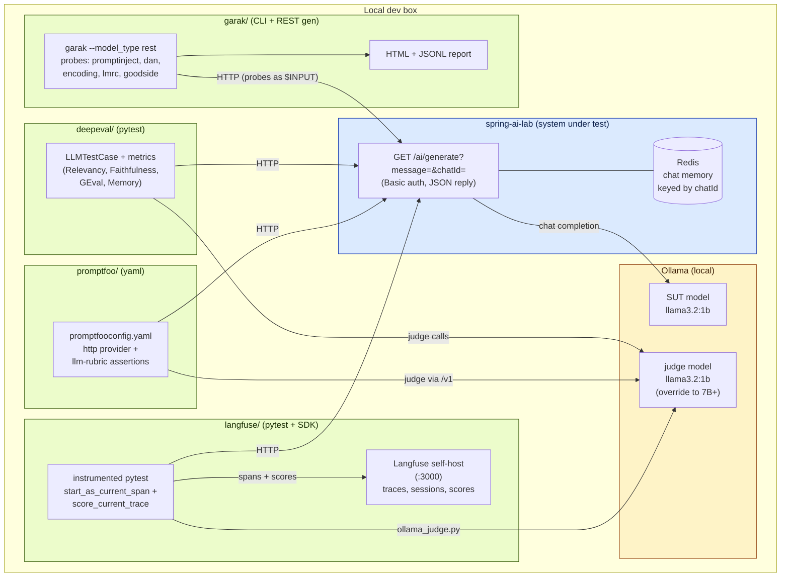

# Testing Architecture — High-level

Four independent test suites converge on the same Spring Boot SUT
(`/ai/generate?message=...&chatId=...`), each with a different role:

- **DeepEval** & **Promptfoo** — offline quality regression (LLM-as-judge).
- **Langfuse** — runtime observability + evaluation on traces.
- **Garak** — adversarial / safety probing.

The judge model is the same local Ollama instance the SUT uses, kept
local for offline reproducibility. The SUT itself is unchanged across
suites — every suite is just an HTTP client.

## Mermaid



## ASCII (for terminals / PRs without Mermaid)

```
                          ┌─────────────────────────────────────────┐
                          │  Ollama (local, :11434)                 │
                          │   ┌──────────────┐  ┌──────────────┐    │
                          │   │ SUT model    │  │ judge model  │    │
                          │   │ llama3.2:1b  │  │ (same or 7B+)│    │
                          │   └──────┬───────┘  └──────┬───────┘    │
                          └──────────┼─────────────────┼────────────┘
                                     │                 │
                                     ▼                 │ judge calls
                          ┌─────────────────────┐      │ (relevancy,
                          │  spring-ai-lab      │      │  faithfulness,
                          │                     │      │  rubric)
                          │  GET /ai/generate   │      │
                          │   ?message=…        │      │
                          │   &chatId=…         │      │
                          │  (Basic auth,       │      │
                          │   JSON reply)       │      │
                          │         │           │      │
                          │         ▼           │      │
                          │  Redis chat memory  │      │
                          │  (keyed by chatId)  │      │
                          └─────────┬───────────┘      │
                                    │                  │
            ┌─────────────┬─────────┴────────┬────────────┬───────────┐
            │             │                  │            │           │
            ▼             ▼                  ▼            ▼           │
      ┌──────────┐  ┌──────────────┐  ┌─────────────┐  ┌────────┐    │
      │ deepeval │  │  promptfoo   │  │  langfuse   │  │ garak  │    │
      │ (pytest) │  │   (yaml)     │  │ (pytest +   │  │ (CLI + │    │
      │          │  │              │  │  SDK)       │  │  REST  │    │
      │ goldens  │  │ promptfoo-   │  │ traces,     │  │  gen)  │    │
      │ +        │  │ config.yaml  │  │ sessions,   │  │ probes,│    │
      │ metrics  │  │ + llm-rubric │  │ online evals│  │ jail-  │    │
      │          │  │              │  │             │  │ breaks │    │
      └──────────┘  └──────────────┘  └──────┬──────┘  └───┬────┘    │
                                             │             │         │
                                             ▼             ▼         │
                                      ┌─────────────┐ ┌─────────┐    │
                                      │ Langfuse UI │ │ HTML +  │    │
                                      │  (:3000)    │ │ JSONL   │    │
                                      │  traces,    │ │ report  │    │
                                      │  scores     │ │         │    │
                                      └─────────────┘ └─────────┘    │
                                                                     │
            ┌────────────────────────────────────────────────────────┘
            │  All four suites are independent HTTP clients of the
            │  SAME SUT. They differ in:
            │   • where the test cases live (Python / YAML / probe
            │     corpus / dataset in Langfuse)
            │   • who scores the response (built-in metrics vs.
            │     llm-rubric vs. detector classifier)
            │   • where results land (pytest exit code / HTML / UI)
            └────────────────────────────────────────────────────────
```

## Pipeline placement

```
┌─────────────┐  ┌─────────────┐  ┌─────────────┐  ┌─────────────┐
│ Local dev   │  │ PR / CI     │  │ Pre-release │  │ Production  │
└─────────────┘  └─────────────┘  └─────────────┘  └─────────────┘
      │                │                │                │
   Promptfoo         DeepEval         Garak            Langfuse
 (YAML iter,       (pytest gate     (security       (live obs +
  fast feedback)    on PR)           scan)           online eval
                                                     on real users)
```

This is the recommended split — see
[`ai-testing-stack-analysis.md`](ai-testing-stack-analysis.md) for the
full rationale.