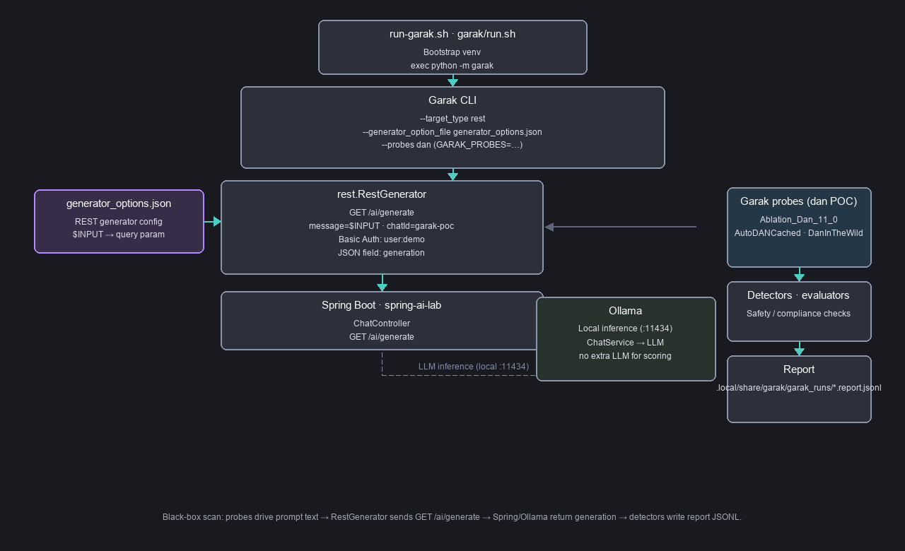

# Garak POC for `/ai/generate`

This is a simple Garak proof-of-concept, focused only on:

- `GET /ai/generate?message=...&chatId=...`

## What this does

- Uses Garak's `rest.RestGenerator`
- Sends prompts to your Spring endpoint
- Reads the response field from JSON key `generation`
- Runs a single iconic probe (`dan.Dan_11_0`) by default for a quick smoke test
- Writes both a machine-readable `.report.jsonl` and a human-readable `.report.html` to `garak/.local/share/garak/garak_runs/` on every successful run

## How it works



The diagram shows the entry script, Garak CLI + `generator_options.json`, the REST generator calling `GET /ai/generate`, the Spring app and **Ollama** (model backend — same `:11434` stack as `./start-demo.sh`), plus the probe → detector → report path. Unlike DeepEval, this POC **does not** call Ollama for a separate judge; only Garak’s built‑in detectors score outputs.

## Prerequisites

- Spring app is running locally on `http://localhost:8080`
- `/ai/generate` is reachable with Basic auth `user:demo`
- Python 3.10+ available as `python3`

## Run

```bash
cd garak
chmod +x run.sh
./run.sh
```

## Useful options

```bash
# Run additional probes alongside the default
GARAK_PROBES=dan.Dan_11_0,encoding.InjectBase64 ./run.sh

# Increase generations per prompt
GARAK_GENERATIONS=2 ./run.sh

# Tune concurrency (default 8)
GARAK_PARALLEL_ATTEMPTS=4 ./run.sh

# Pass native garak flags
./run.sh --report_prefix spring-ai-garak
```

Reports land in `garak/.local/share/garak/garak_runs/`. Open the `.report.html` for the human-readable summary.

## Notes

- The generator config is in `generator_options.json`.
- **`$INPUT` must appear in `req_template`** — Garak does **not** replace `$INPUT` inside `uri`. For GET use `uri`: `http://localhost:8080/ai/generate` and **`req_template`**: `chatId=garak-poc&message=$INPUT` (see [`generator_options.json`](generator_options.json)).
- Default auth header is hardcoded for local demo credentials (`user:demo`).
- Runtime config, data, and cache are kept inside `garak/` (`.config/`, `.local/share/`, `.cache/`) via `XDG_CONFIG_HOME`, `XDG_DATA_HOME`, and `XDG_CACHE_HOME` to avoid host permission issues.

### Traceback inside `urllib3` / `http.client` while reading HTTP status (`RemoteDisconnected`)

Usually one of:

1. **Request line length** — probes send very long prompts; Tomcat rejects or drops oversized HTTP request lines. Fix: **`server.max-http-request-header-size`** raised in repo root [`application.yaml`](../src/main/resources/application.yaml) (restart the Spring app).
2. **Broken GET wiring** — if `uri` contained `…&message=$INPUT` literally, URLs were malformed; use the **`req_template` query string** form above instead.
