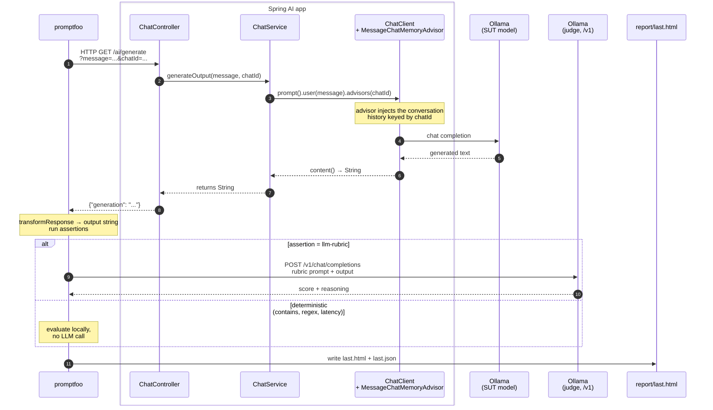

# Promptfoo — POC Plan

> Template. Fill in `TBD` blocks as we run each demonstration. Companion docs:
> [`../docs/promptfoo-guide.md`](../docs/promptfoo-guide.md) (how it works) and
> [`../docs/promptfoo-analysis.md`](../docs/promptfoo-analysis.md) (best-practices gap analysis).

---

## 1. Goal

> One sentence stating what this POC must answer for the AI Team.

**Question:** *Does promptfoo earn a place in our evaluation stack alongside DeepEval and Langfuse, and if so — for which pipeline stages?*

**Setup principle — judge stronger than SUT.** The system under test is a production-realistic small model (`llama3.2:1b`): cheap, low-latency, scalable to many concurrent users. The judge is a deliberately stronger model (`llama3.1:8b`) so it can reliably recognize SUT errors. The asymmetry is intentional and mirrors both the human-QA pattern (senior reviewing junior) and the LLM-as-Judge literature ([Zheng et al., 2023](https://arxiv.org/abs/2306.05685)), which used 7–13B SUTs evaluated by GPT-4. A judge weaker than the SUT cannot see the SUT's mistakes, so judge ≥ SUT is a structural requirement, not a luxury.

**Decision criteria (what "yes" looks like):**

- TBD — concrete pass/fail bars (e.g. "≥ N adversarial cases auto-generated in < M minutes", "PR gate runs in < X seconds locally")

---

## 2. Scope

| In scope | Out of scope |
|---|---|
| `GET /ai/generate` endpoint of `spring-ai-lab` | RAG endpoints (covered by `deepeval/`) |
| Single-turn quality cases | Production tracing (covered by `langfuse/`) |
| Multi-turn memory regression | Tool-calling agents (`/agent/chat`) |
| Adversarial / red-team probes (TBD) | Cost benchmarking on paid providers (TBD) |
| Multi-provider comparison (TBD) | |

---

## 3. Hypothesis

> What we expect, before running anything. Stating it up front makes the verdict
> in §6 honest rather than retro-fitted.

- **H1:** Promptfoo is faster to iterate on than DeepEval for the same case count.
- **H2:** Promptfoo's HTML report is more useful for non-engineer reviewers.
- **H3:** Promptfoo's red-team generator produces meaningful adversarial coverage with < 1 day of setup.
- **H4:** Promptfoo's `llm-rubric` is too noisy with the local 1B judge to be CI-trustworthy without a stronger judge.
- **H5:** TBD

---

## 4. Setup

**Prerequisites**

- Java 21, Docker, Node.js 20+
- Local Ollama with `llama3.2:1b` (and ideally `llama3.1:8b` as judge — see [`README.md`](README.md))

**Boot the SUT**

```bash
./start-demo.sh                    # repo root — Spring + Ollama + Redis
```

**Run promptfoo**

```bash
cd promptfoo
./run.sh                           # all tests → report/last.html
./run.sh --filter-pattern memory   # only memory regression
./run.sh --no-cache                # force fresh judge calls
```

---

## 5. Integration with the Spring AI codebase

How a single test row from promptfoo travels through the Spring AI classes,
hits Ollama, comes back, and lands in the final report. The grey box groups
the application classes the data flows through, so anyone reviewing the
diagram can navigate straight to the source.



### How to read the diagram

- **Promptfoo never touches Spring AI internals.** It speaks plain HTTP
  against `/ai/generate`. If tomorrow you swap `ChatService` for a different
  implementation (different model, different prompt template, different
  provider), promptfoo needs no changes as long as the endpoint contract
  holds.
- **`chatId` is the integration hinge.** It travels in the URL, reaches
  `MessageChatMemoryAdvisor`, and that advisor decides which conversation
  history to inject. Reusing the same `chatId` across test rows = continuing
  a conversation; a fresh `chatId` = clean slate. This is exactly what
  `tests/multi_turn.yaml` exploits.
- **The `alt` block shows where the cost economics live.** Deterministic
  assertions (`contains`, `regex`, `latency`, `is-json`) are evaluated
  locally with no LLM call; only `llm-rubric` (and `factuality`) trigger the
  judge model. A suite that uses deterministic assertions whenever possible
  runs orders of magnitude faster and cheaper.

---

## 6. Demonstrations

> Each demo is a focused scenario that proves one *specific* advantage or
> disadvantage. Keep them small — one screenshot or paragraph per demo is enough.

### Demo 1 — Fast iteration loop (advantage)

- **What it shows:** authoring + running a new case end-to-end in under 60 seconds.
- **Test file:** [`tests/single_turn.yaml`](tests/single_turn.yaml)
- **Steps:** add a new YAML row → `./run.sh --filter-pattern <new-desc>` → open report.
- **Comparison anchor:** equivalent change in [`../deepeval/tests/test_chat.py`](../deepeval/tests/test_chat.py) requires editing `*.py`, possibly a golden module, then running pytest.
- **Verdict:** TBD

### Demo 2 — Regression replay (advantage)

- **What it shows:** turning a real production bug into a permanent regression case in a one-line PR diff.
- **Setup:** pick a real or simulated bug (e.g. SUT failed to refuse a sensitive request).
- **Steps:** add a YAML row tagged `metadata: { category: regression, ticket: <ID> }` → run.
- **Verdict:** TBD

### Demo 3 — Cross-run diff (advantage)

- **What it shows:** detecting which cases changed verdict between two runs (model upgrade, prompt change, dependency bump).
- **Setup:** run once, change one variable (judge model, SUT prompt, model temperature), run again with timestamped output.
- **Compare:** `npx promptfoo@latest view --compare <runA.json> <runB.json>`
- **Verdict:** TBD

### Demo 4 — Multi-provider comparison (advantage)

- **What it shows:** the same test cases scored against two SUT configurations side-by-side.
- **Setup:** boot the Spring app twice on different ports with different `APP_CHAT_MODEL` values (Ollama vs OpenAI vs Bedrock — see [`../README.md` provider profiles](../README.md#provider-profiles)).
- **Config:** add a second `providers:` block in `promptfooconfig.yaml`.
- **Verdict:** TBD

### Demo 5 — Red-team / adversarial layer (advantage)

- **What it shows:** auto-generation of dozens-to-hundreds of adversarial cases with no manual authoring.
- **Steps:**
  ```bash
  npx promptfoo@latest redteam init --no-gui
  npx promptfoo@latest redteam generate
  npx promptfoo@latest redteam run
  ```
- **Plugins to enable:** `harmful`, `pii`, `prompt-injection`, `jailbreak`, `hallucination`.
- **Verdict:** TBD

### Demo 6 — Stakeholder-readable report (advantage)

- **What it shows:** a non-engineer (PM, clinician, QA student) reviews `report/last.html` and successfully identifies the failing cases without help.
- **Steps:** run the suite → share `report/last.html` → ask a non-engineer reviewer to summarize what failed and why.
- **Verdict:** TBD

### Demo 7 — Judge noise (disadvantage)

- **What it shows:** the 1B `llm-rubric` judge scores the same case differently across runs.
- **Steps:** `./run.sh --no-cache` three times in a row → diff the JSON reports for verdict flips.
- **Verdict:** TBD — quantify with a flip rate (e.g. "X out of Y cases flipped on at least one re-run").

### Demo 8 — Limited RAG decomposition (disadvantage)

- **What it shows:** promptfoo cannot score the retriever stage independently from the generator stage. A failing answer doesn't tell you *which* part of the chain failed.
- **Steps:** add a RAG case via `/support`. Compare the diagnostic value of promptfoo's verdict vs. DeepEval's `Faithfulness` + `ContextualPrecision` scores on the same case.
- **Verdict:** TBD

### Demo 9 — Multi-turn concurrency caveat (disadvantage)

- **What it shows:** running with `-j 2` or higher can interleave priming and checking rows, producing false failures.
- **Steps:** run `./run.sh -j 4 --filter-pattern memory` repeatedly, observe inconsistent results.
- **Verdict:** TBD — known mitigation: pin `-j 1` for memory tests.

### Demo 10 — TBD

> Reserve a slot for whatever the team asks for live during the presentation.

---

## 7. Findings — advantages vs disadvantages observed

| # | Demo | Claim | Evidence (report row / screenshot) | Verdict |
|---|---|---|---|---|
| 1 | Fast iteration | Advantage | TBD | TBD |
| 2 | Regression replay | Advantage | TBD | TBD |
| 3 | Cross-run diff | Advantage | TBD | TBD |
| 4 | Multi-provider | Advantage | TBD | TBD |
| 5 | Red-team | Advantage | TBD | TBD |
| 6 | Stakeholder report | Advantage | TBD | TBD |
| 7 | Judge noise | Disadvantage | TBD | TBD |
| 8 | RAG decomposition | Disadvantage | TBD | TBD |
| 9 | Multi-turn concurrency | Disadvantage | TBD | TBD |

---

## 8. Recommendation

> Filled in after demonstrations. Should answer: adopt / partial-adopt / drop, and
> for which pipeline stage.

- **Adopt for:** TBD (e.g. local dev iteration, PR smoke gate, red-team layer)
- **Do NOT adopt for:** TBD (e.g. RAG decomposition — keep DeepEval, runtime observability — keep Langfuse)
- **Required follow-ups before production use:** TBD (CI workflow, stronger judge, env-var auth — see [`../docs/promptfoo-analysis.md`](../docs/promptfoo-analysis.md) §2)

---

## 9. Open questions

- TBD — what we still don't know after the POC, and what would settle it.
- Example: "Does the cloud-shared report leak prompt content under our data policy? Need security review before enabling `promptfoo share`."

---

## 10. Appendix — references

- Suite-level architecture: [`../docs/testing-architecture.md`](../docs/testing-architecture.md)
- How promptfoo works in this repo: [`../docs/promptfoo-guide.md`](../docs/promptfoo-guide.md)
- Best-practices gap analysis + capability matrix: [`../docs/promptfoo-analysis.md`](../docs/promptfoo-analysis.md)
- Promptfoo docs: https://www.promptfoo.dev/docs
